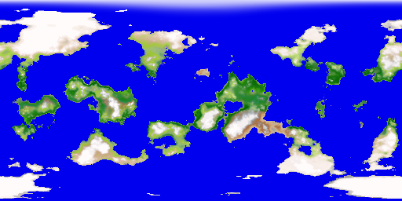
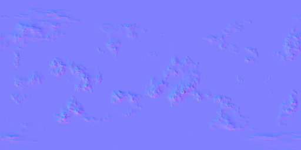
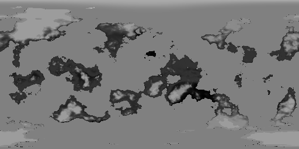
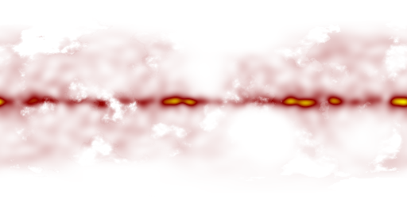
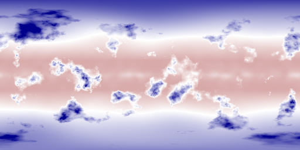

# planet-generator

Java based random generator for planets.

The generator is pure Java without any external dependencies.

The viewer is a separate project that uses JavaFX.

## Example Code

The following code snippets show a typical simple use case.

### Generate an instance of Planet

The first step to generate a planet is to define the unique random seed for the planet and
generate the basic planet data from it.

```java
        PlanetGenerator planetGenerator = new PlanetGenerator();

        // unique seed for the planet
        long[] seed = new long[] { 4 };

        // generate planet data for unique seed
        PlanetData planetData = planetGenerator.createPlanetData(seed);

        // print some random generated planet values
        System.out.println("radius : " + planetData.radius + " m");
        System.out.println("revolutionTime : " + planetData.revolutionTime + " s");
        System.out.println("orbitTime : " + planetData.orbitTime + " s");

        // modify generated planet data if you need to fulfill special constraints
        planetData.baseTemperature = 290; // Celsius - expect warm tropics at the equator, small polar caps

        // create planet according to planet data constraints
        Planet planet = planetGenerator.createPlanet(planetData);
```

The output looks like this:
```console
radius : 5137796.466254459 m
revolutionTime : 59521302 s
orbitTime : 40005614677 s
```

### Query a specific point on a Planet 

With the planet data generated we can now generate specific information for any point of the surface of the planet.

This is useful to know the conditions at the location of the player in a game.

```java
        // specify which layers and what accuracy you need (default has all layers and good enough accuracy)
        PlanetGenerationContext context = planet.createDefaultContext();

        // generate planet at one specific point (useful to know about the current location of a player in a game)
        double latitudeRadians = Math.toRadians(90.0);
        double longitudeRadians = Math.toRadians(0.0);
        PlanetPoint planetPoint = planet.getPlanetPoint(latitudeRadians, longitudeRadians, context);

        // print some values for the specific point on the planet
        System.out.println("height : " + planetPoint.height + " m");
        System.out.println("temperature : " + planetPoint.temperature + " K");
        System.out.println("precipitation : " + planetPoint.precipitation);
        System.out.println("color : " + planetPoint.color);
```

The output looks like this:
```console
height : 6015.265244579083 m
temperature : 271.7990658042786 K
precipitation : 0.0
color : (0.6295682289054663, 0.5518509754711629, 0.4010190099591988)
```

### Create textures for a Planet

To render an entire planet we can create the necessary textures into images.

The following example creates all texture types that the framework knows about.

```java
        // specify context and add the texture types you want to generate (we simply add all of them)
        PlanetGenerationContext context = planet.createDefaultContext();
        context.textureTypes.addAll(Arrays.asList(TextureType.values()));

        // generate 512 x 256 pixel textures for the entire planet
        Map<TextureType, TextureWriter<BufferedImage>> textures = planet.getTextures(512, 256, context, (width, height, textureType) -> new BufferedImageTextureWriter(width, height));

        // save the textures into png files
        try {
            for (Map.Entry<TextureType, TextureWriter<BufferedImage>> entry : textures.entrySet()) {
                String filename = entry.getKey().name().toLowerCase() + ".png";
                BufferedImage image = entry.getValue().getTexture();
                ImageIO.write(image, "png", new File(filename));
            }
        } catch (IOException e) {
            e.printStackTrace();
        }
```

The following textures where generated with the sample code above.

Surface color map:



Normal map:



Specular map:



Average Precipitation Map:



Average Temperature Map:



The full set of example textures is [here](ch.obermuhlner.planetgen.docs/images/seed123).

## JavaFX Viewer

For debugging purposes an interactive JavaFX viewer was written that allows to
see and modify many planet data values and
analyze the generated planet.

Interactive textures with point information and zoom.


Animated Planet 3D rendering.


Interactive animated Terrain 3D rendering with zoom.


Visualization of mathematical crater models. 


