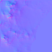

# planet-generator

Java library to procedurally generate earth-like planets.

The generator is pure Java without any external dependencies.

The viewer is a separate project that uses JavaFX.

## Features

- pure Java library
- full procedural generation
- generate different textures
- generate terrain mesh data
- query physical information for every point of the planet surface
- supports biome information
- creates impact craters
- simple physical model for temperature, precipitation, clouds, ice, snow, ...

## Example Code

The following code snippets show some typical use cases.

### Generate an instance of Planet

The first step to generate a planet is to define the unique random seed for the planet and
generate the basic planet data from it.

```java
        PlanetGenerator planetGenerator = new PlanetGenerator();

        // unique seed for the planet
        long[] seed = new long[] { 4 };

        // generate planet data for unique seed
        PlanetData planetData = planetGenerator.createPlanetData(seed);

        // print some random generated planet values
        System.out.println("radius : " + planetData.radius + " m");
        System.out.println("revolutionTime : " + planetData.revolutionTime + " s");
        System.out.println("orbitTime : " + planetData.orbitTime + " s");

        // modify generated planet data if you need to fulfill special constraints
        planetData.baseTemperature = 290; // 290 K ~= 17 C ~= 62 F --- expect warm tropics at the equator, small polar caps

        // create planet according to planet data constraints
        Planet planet = planetGenerator.createPlanet(planetData);
```

The output looks like this:
```console
radius : 5137796.466254459 m
revolutionTime : 59521302 s
orbitTime : 40005614677 s
```

### Query a specific point on a Planet 

With the planet data generated we can now generate specific information for any point of the surface of the planet.

This is useful to know the conditions at the location of the player in a game.

```java
        // specify which layers and what accuracy you need (default has all layers and good enough accuracy)
        PlanetGenerationContext context = planet.createDefaultContext();

        // generate planet at one specific point
        double latitudeRadians = Math.toRadians(90.0);
        double longitudeRadians = Math.toRadians(0.0);
        PlanetPoint planetPoint = planet.getPlanetPoint(latitudeRadians, longitudeRadians, context);

        // print some values for the specific point on the planet
        System.out.println("height : " + planetPoint.height + " m");
        System.out.println("temperature : " + planetPoint.temperature + " K");
        System.out.println("precipitation : " + planetPoint.precipitation);
        System.out.println("color : " + planetPoint.color);
```

The output looks like this:
```console
height : 6015.265244579083 m
temperature : 271.7990658042786 K
precipitation : 0.0
color : (0.6295682289054663, 0.5518509754711629, 0.4010190099591988)
```

### Create textures for a Planet

To render an entire planet we can create the necessary textures into images.

The following example creates all texture types that the framework knows about and saves them into files.

```java
        // specify context and add the texture types you want to generate (we simply add all of them)
        PlanetGenerationContext context = planet.createDefaultContext();
        context.textureTypes.addAll(Arrays.asList(TextureType.values()));

        // generate 512 x 256 pixel textures for the entire planet
        Map<TextureType, TextureWriter<BufferedImage>> textures = planet.getTextures(512, 256, context, (width, height, textureType) -> new BufferedImageTextureWriter(width, height));

        // save the textures into png files
        try {
            for (Map.Entry<TextureType, TextureWriter<BufferedImage>> entry : textures.entrySet()) {
                String filename = entry.getKey().name().toLowerCase() + ".png";
                BufferedImage image = entry.getValue().getTexture();
                ImageIO.write(image, "png", new File(filename));
            }
        } catch (IOException e) {
            e.printStackTrace();
        }
```

The following textures where generated with the sample code above.

Surface color map:


Normal map:


Specular map:


Average Precipitation Map:


Average Temperature Map:


The full set of example textures is [here](ch.obermuhlner.planetgen.docs/images/planet_textures).


## Create textures and height map for terrain

To render a terrain you need to generate the mesh and textures for the terrain.

The conversion of the terrain height map into a mesh depends on the 3D library you use in your renderer.
The following code snippet simply prints the values of the height map.

```java
        // specify context and add the texture types you want to generate (we simply add all of them)
        PlanetGenerationContext context = planet.createDefaultContext();
        context.accuracy = 1; // meters
        context.textureTypes.addAll(Arrays.asList(TextureType.values()));

        // create terrainHeightMap to be filled
        DoubleMap terrainHeightMap = new DoubleMap(16, 16);

        // generate terrain textures and fill terrain height map for the specified area
        Map<TextureType, TextureWriter<BufferedImage>> textures = planet.getTextures(
                Math.toRadians(90.0), Math.toRadians(100.0), Math.toRadians(180.0), Math.toRadians(190.0),
                64, 64, context, (width, height, textureType) -> new BufferedImageTextureWriter(width, height), terrainHeightMap);

        // save the textures into png files
        try {
            for (Map.Entry<TextureType, TextureWriter<BufferedImage>> entry : textures.entrySet()) {
                String filename = "terrain_" + entry.getKey().name().toLowerCase() + ".png";
                BufferedImage image = entry.getValue().getTexture();
                ImageIO.write(image, "png", new File(filename));
            }
        } catch (IOException e) {
            e.printStackTrace();
        }

        // use the terrain height map to create the 3D mesh
        for(int y = 0; y < terrainHeightMap.height; y++) {
            for (int x = 0; x < terrainHeightMap.width; x++) {
                if (x > 0) {
                    System.out.print(", ");
                }
                System.out.print(terrainHeightMap.getValue(x, y));
            }
            System.out.println();
        }
```

The output looks like this:
```console
5489.898749837851, 4471.268777925344, 4468.983375629327, 4350.646818044562, 4649.039811173835, 4102.277022713687, 3610.966842788416, 3025.767283526434, 2336.737514165431, 1883.273910496392, 1563.916787365276, 1401.429576906501, 1232.391953872694, 1098.1179502361874, 971.170228855176, 918.1472957393389
4701.42107898749, 4621.983539315942, 5601.481916916854, 6040.508911990006, 5792.126161150626, 4337.567824918225, 3227.189370439525, 2810.606457798912, 2388.3277548438646, 1775.8112997035014, 1542.8048133370557, 1317.4937295345871, 1097.1618910509796, 880.4195784505218, 725.1598352425881, 639.8835091066876
4735.97049320655, 4709.099132146011, 5314.440398093927, 6148.248928435732, 5673.96852238723, 4477.702000195767, 3298.768303500835, 2659.8442242805677, 2080.140461505328, 1709.023843990919, 1374.0575357035013, 1151.3979602021982, 944.5455144625485, 757.2690652062702, 508.16905557473456, 333.70457602977694
5325.551715553819, 5115.942863854324, 5649.121835657635, 6484.441467290666, 5320.965403440911, 4398.987988836087, 3578.8909567429664, 2417.0024246971143, 1756.5331149753774, 1357.967179500988, 1140.6441178443629, 881.532745297256, 772.9045828487397, 519.9778724764219, 296.45671775670326, 97.53588120477889
5433.510395319024, 5770.7745289228515, 6329.7465290714035, 6272.304615145475, 4942.6670193477685, 3834.6357477129395, 3299.0006258748153, 2203.7261170348365, 1595.961265505699, 1174.001214007144, 910.139679521455, 678.0264515400104, 451.0134265841343, 333.59785979978733, 162.05429510191698, 0.0
5017.988731402772, 5173.53438082652, 5424.665827607197, 6327.460451410024, 4554.1989268912685, 3620.56654234273, 2832.79863695941, 2046.0851349458617, 1472.491777219141, 1017.552307922002, 717.6108651805707, 477.79154998035756, 307.3093901945231, 136.6215066859304, 0.0, 0.0
4709.57487925033, 4526.032651940451, 4391.042942057761, 4241.32078740184, 3856.489791402785, 3255.443931561126, 2379.7313662412935, 1854.339350011488, 1329.9056721090628, 899.6985862606089, 586.8401114208509, 347.80035242662507, 196.83049901556387, 25.218009821684063, 0.0, 0.0
5363.414858681698, 4627.28659508637, 4071.47909426318, 3614.1046110418984, 3021.1042133909186, 2836.2810000520813, 2218.2686474160664, 1738.8762782897002, 1182.5195844220698, 763.7678568912006, 468.5345595229901, 274.6664124634008, 59.82482151564545, 0.0, 0.0, 0.0
4548.413703955205, 4091.4678272434676, 3873.0508442456658, 3412.4740028284095, 2888.4328559852156, 2612.5202053880957, 2076.7330375693737, 1531.8586702210005, 1009.3558023574969, 695.5595175510007, 432.0749181559995, 313.533245332811, 0.0, 0.0, 0.0, 0.0
4375.492786389766, 3892.0148708484276, 3706.364992566344, 3574.386356110005, 2887.850843594052, 2509.4510713157642, 2223.760136962791, 1696.9984204549519, 1089.2548169124575, 868.0790696075792, 496.1299243233598, 99.22034140895084, 0.0, 0.0, 0.0, 0.0
4587.539963957511, 4243.7136342571675, 3769.4715897806173, 3129.338438523483, 3252.802988534547, 3030.7313359304308, 2177.2037740380174, 1732.7958796842713, 1478.1722312062548, 851.6346802515518, 531.5189555345514, 0.0, 0.0, 0.0, 0.0, 0.0
4396.347737013605, 5066.626635938039, 3906.690585325895, 3070.1573514891506, 2835.390074881482, 2334.9812337174744, 1765.2471962030477, 1457.7398995662725, 1337.8901132145984, 820.9090682082078, 385.75380856416905, 0.0, 0.0, 0.0, 0.0, 0.0
3752.8272756544184, 4149.132621594451, 3994.616969800699, 3019.15071959706, 2239.3489934268628, 1732.358346624028, 1528.820260020564, 1087.262186793946, 726.1892559406651, 474.02742925698567, 287.00437215288, 0.0, 0.0, 0.0, 0.0, 0.0
2886.729637822723, 2910.296766750468, 3307.3954732219545, 2554.6036917349747, 1787.0023071850037, 1432.4505996767475, 1207.924309159106, 740.3354550586755, 448.5396851382302, 225.37850590913968, 0.0, 0.0, 0.0, 0.0, 0.0, 0.0
2400.2142745172378, 2228.3421107130207, 2114.166473438371, 1947.718222190556, 1612.8597756402496, 1300.431139830308, 1056.6437969661392, 693.9479640706459, 559.1918727273969, 172.62659604277724, 0.0, 0.0, 0.0, 0.0, 0.0, 0.0
2213.204457843455, 1927.4320979217619, 1752.979830529196, 1618.5553875228188, 1516.4871246154707, 1532.746970552882, 1000.0988322189642, 644.4311497084709, 618.9590170571792, 152.05721019525845, 0.0, 0.0, 0.0, 0.0, 0.0, 0.0
```

When you interpret these values as a 3D mesh you get the following wireframe.


The following terrain textures where generated with the sample code above and can be used to render the mesh.
Note that the textures where generated with higher density than the terrain mesh.

Surface color map:


Normal map:



Specular map:


The full set of example textures is [here](ch.obermuhlner.planetgen.docs/images/terrain_textures).


## JavaFX Viewer

For debugging purposes an interactive JavaFX viewer was written that allows to
see and modify many planet data values and
analyze the generated planet.

### Interactive textures

Interactive textures can be clicked to show zoomed textures, point information and a height cut.


### Animated 3D Planet


### Animated 3D Terrain 3D

The animated 3D terrain shows the same section of the planet as the zoom textures.


### Mathematical crater models 

The mathematical models used to create the craters and vulcanoes can be visualized.


